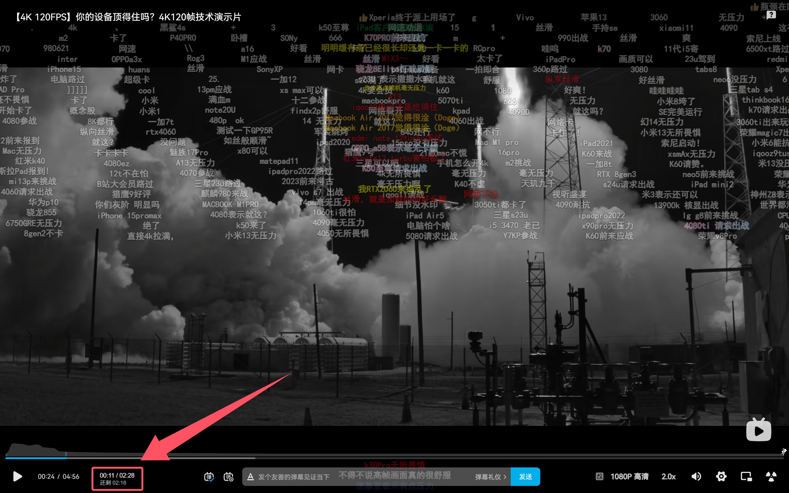

# Bilibili 倍速真实时长显示插件

> 在 B 站播放器进度条旁实时显示基于当前倍速的**实际观看时长**和**剩余时间**。

## 效果预览

## 主要功能

- **自动检测倍速**：实时监听播放器的倍速变化（1.25x, 1.5x, 2.0x 等）。
- **真实时长换算**：
  - 显示 `实际当前进度 / 实际总时长`。
  - 显示 `还剩 xx:xx`
- **智能隐藏**：当倍速为 `1.0x` 时自动隐藏，保持界面清爽。
- **原生风格**：UI 样式完全融入 B 站播放器，毫无违和感。

## 安装方法

由于本项目尚未发布到 Chrome/Edge 应用商店，请使用**开发者模式**安装：

1. **下载代码**：
   - 点击右上角的绿色的 `Code` 按钮 -> `Download ZIP`。
   - 解压下载的压缩包。

2. **导入浏览器**：
   - 打开 Chrome 或 Edge 浏览器，在地址栏输入 `chrome://extensions` 并回车。
   - 打开右上角的 **「开发者模式」** 开关。
   - 点击左上角的 **「加载已解压的扩展程序」**。
   - 选择你刚才解压的文件夹（包含 `manifest.json` 的那个文件夹）。

3. **开始使用**：
   - 打开任意一个 Bilibili 视频。
   - 调整倍速（例如 1.5x），你会发现进度条右侧多了一行神奇的小字！🎉

## 文件结构

- `manifest.json`: 插件的配置文件（基于 Manifest V3 标准）。
- `content.js`: 核心逻辑代码，负责计算时间并操作 DOM。
- `styles.css`: 样式文件，确保文字排版美观。

## 🤝 贡献与反馈

如果你发现有 BUG 或者有更好的想法，欢迎提交 Issue 或 Pull Request！
我的个人博客:
https://duckling-io.github.io
---
# Bilibili Real-Time Duration Display

> Display the **actual viewing duration** and **remaining time** based on the current playback speed next to the Bilibili player progress bar in real-time.

## Preview

## Key Features

- **Auto-Detect Playback Speed**: Real-time monitoring of playback speed changes (1.25x, 1.5x, 2.0x, etc.).
- **Real Duration Calculation**:
  - Displays `Actual Current Progress / Actual Total Duration`.
  - Displays `Remaining: xx:xx` (Lets you know exactly how long until you finish the video).
- **Smart Hide**: Automatically hides when the speed is `1.0x` to keep the interface clean.
- **Native Style**: The UI style integrates seamlessly with the Bilibili player, preserving the original look and feel.

## Installation

Since this project has not yet been published to the Chrome/Edge Web Store, please use **Developer Mode** to install:

1. **Download Code**:
   - Click the green `Code` button on the top right -> `Download ZIP`.
   - Unzip the downloaded file.

2. **Import to Browser**:
   - Open Chrome or Edge browser, type `chrome://extensions` in the address bar, and press Enter.
   - Toggle on **"Developer mode"** in the top right corner.
   - Click **"Load unpacked"** in the top left corner.
   - Select the folder you just unzipped (the one containing `manifest.json`).

3. **Start Using**:
   - Open any Bilibili video.
   - Adjust the playback speed (e.g., 1.5x), and you will see a magical new line of text next to the progress bar! 🎉

## File Structure

- `manifest.json`: Configuration file (Based on Manifest V3 standard).
- `content.js`: Core logic for time calculation and DOM manipulation.
- `styles.css`: Styling file to ensure the UI looks good.

## 🤝 Contribution & Feedback

If you find any bugs or have better ideas, feel free to submit an Issue or Pull Request!

**My Blog:** [Duckling-IO](https://duckling-io.github.io)

---
**Enjoy your efficient watching! ⚡**
